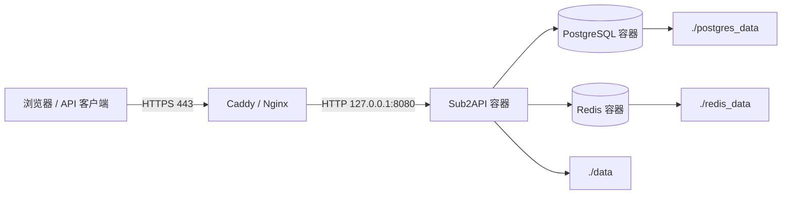

# Sub2API Docker 服务器部署手册

> 适用范围：Linux 服务器上的单机 Docker Compose 部署。本文以仓库当前的 `deploy/docker-compose.local.yml` 为准，推荐采用本地目录持久化方案；它便于备份、迁移和恢复。文中命令以 Bash 为例，需按自己的域名、目录和密码替换占位内容。

## 1. 部署方案与目标架构

推荐将应用、PostgreSQL 和 Redis 放在同一个 Compose 项目中。应用只对宿主机暴露 HTTP 端口；PostgreSQL、Redis 仅通过 Docker 内部网络通信，不应映射到公网。



| Compose 文件 | 场景 | 数据位置 | 建议 |
| --- | --- | --- |
| `deploy/docker-compose.local.yml` | 单机生产、需要备份或迁移 | 部署目录的 `data/`、`postgres_data/`、`redis_data/` | **推荐** |
| `deploy/docker-compose.yml` | 快速试用 | Docker named volumes | 可用，但迁移和人工备份较不直观 |
| `deploy/docker-compose.standalone.yml` | 已有外部 PostgreSQL/Redis | 应用数据为 named volume | 仅在数据库和 Redis 已被专业托管时使用 |
| `deploy/docker-compose.dev.yml` | 本地源码构建和开发 | 本地目录 | 不用于生产 |

## 2. 上线前准备

### 2.1 服务器与网络

- 准备一台可稳定访问上游 AI 服务的 Linux 服务器，并为数据库、Redis、日志和备份预留足够磁盘空间。
- 域名部署时，先将域名 A/AAAA 记录指向服务器公网 IP；开放 TCP `80`、`443`。若暂时不使用反向代理，则仅临时开放 `8080`。
- 不要把 `5432`（PostgreSQL）和 `6379`（Redis）暴露到公网；当前 Compose 文件默认也不会发布这两个端口。
- 确认服务器时间与时区正确。`TZ` 会影响日志、订阅到期和“当天”用量的边界。

### 2.2 安装并核验 Docker

请使用发行版官方方式或 Docker 官方安装方式安装 Docker Engine 和 Compose 插件。安装后核验：

```bash
docker --version
docker compose version
docker run --rm hello-world
```

若当前登录用户不具备 Docker 权限，请使用具备权限的账号执行命令，或将运维用户加入 `docker` 组后重新登录。请注意：拥有 Docker 控制权限通常等同于拥有较高的主机权限。

### 2.3 建议的部署目录与权限

以下示例使用 `/opt/sub2api`，也可替换为受备份系统管理的目录。

```bash
sudo mkdir -p /opt/sub2api
sudo chown "$USER":"$USER" /opt/sub2api
cd /opt/sub2api
```

将 `.env` 权限设为仅部署用户可读写：

```bash
chmod 600 .env
```

> `.env` 内含数据库密码、JWT 密钥、TOTP 加密密钥及可能的 OAuth 密钥，禁止提交到 Git、发送到聊天群或放入公开备份。

## 3. 推荐部署：本地目录持久化

### 3.1 获取部署文件

可克隆整个仓库，以便同时保留部署说明和可选配置模板：

```bash
git clone https://github.com/Wei-Shaw/sub2api.git /opt/sub2api/source
cd /opt/sub2api
cp source/deploy/docker-compose.local.yml docker-compose.yml
cp source/deploy/.env.example .env
```

也可以仅下载部署脚本。脚本会获取本地目录版 Compose、`.env.example`，并生成 `POSTGRES_PASSWORD`、`JWT_SECRET`、`TOTP_ENCRYPTION_KEY`：

```bash
mkdir -p /opt/sub2api
cd /opt/sub2api
curl -fsSLO https://raw.githubusercontent.com/Wei-Shaw/sub2api/main/deploy/docker-deploy.sh
chmod 700 docker-deploy.sh
./docker-deploy.sh
```

脚本会在终端显示生成的密钥；请立即存入密码管理器。若要完全可控，建议按下一节手工配置。

### 3.2 创建并配置 `.env`

先创建数据目录，再修改 `.env`：

```bash
cd /opt/sub2api
mkdir -p data postgres_data redis_data
nano .env
```

不要在首次启动前为这三个绑定挂载目录强制设置过严的固定属主或权限；PostgreSQL、Redis 镜像会在初始化时按容器内运行账户处理目录。应只确保部署用户和 Docker 守护进程可以访问父目录，并将敏感的 `.env` 文件单独设为 `600`。

至少应明确设置下列项目：

```dotenv
# 对外 HTTP 监听。使用反向代理时建议仅绑定本机回环地址。
BIND_HOST=127.0.0.1
SERVER_PORT=8080
SERVER_MODE=release
RUN_MODE=standard
TZ=Asia/Shanghai

# PostgreSQL：必须替换为高强度随机密码。
POSTGRES_USER=sub2api
POSTGRES_PASSWORD=替换为至少32字节随机密码
POSTGRES_DB=sub2api

# Redis：生产环境建议设置密码。
REDIS_PASSWORD=替换为独立的高强度随机密码

# 初始管理员。请设置密码，避免首次启动后再从日志中提取随机密码。
ADMIN_EMAIL=admin@example.com
ADMIN_PASSWORD=替换为高强度管理员密码

# 以下两个值必须固定保存；更换后会使现有登录会话或 TOTP 失效。
JWT_SECRET=替换为64位十六进制随机值
TOTP_ENCRYPTION_KEY=替换为64位十六进制随机值

# 生产安全基线。仅在确有内网需求时才允许私网主机。
SECURITY_URL_ALLOWLIST_ENABLED=true
SECURITY_URL_ALLOWLIST_ALLOW_INSECURE_HTTP=false
SECURITY_URL_ALLOWLIST_ALLOW_PRIVATE_HOSTS=false
# 启用白名单时填写实际要访问的上游域名，逗号分隔。
SECURITY_URL_ALLOWLIST_UPSTREAM_HOSTS=
```

生成随机值的示例：

```bash
openssl rand -hex 32
```

执行三次，分别作为 PostgreSQL 密码、JWT 密钥和 TOTP 加密密钥；Redis 与管理员密码也应使用独立随机值。不要在命令历史、工单或截图中保留真实密钥。

### 3.3 关键参数说明

| 参数 | 作用 | 生产建议 |
| --- | --- | --- |
| `BIND_HOST` | Docker 端口发布地址 | 有反代时使用 `127.0.0.1`；无反代才用 `0.0.0.0` |
| `SERVER_PORT` | 宿主机暴露的 HTTP 端口 | 保持 `8080`，由反代接管 443 |
| `RUN_MODE` | `standard` 为完整计费/订阅模式；`simple` 跳过计费和余额校验 | 对外服务使用 `standard` |
| `POSTGRES_PASSWORD` | 内置 PostgreSQL 密码 | 必填且高强度；不要更改已运行实例的值 |
| `REDIS_PASSWORD` | Redis 认证密码 | 建议设置；Compose 会自动传给应用和 Redis |
| `JWT_SECRET` | 登录与访问令牌签名密钥 | 必须固定，变更会令现有登录会话失效 |
| `TOTP_ENCRYPTION_KEY` | TOTP 密钥加密密钥 | 必须固定，丢失/变更后既有 2FA 无法解密 |
| `TZ` | 全局时区 | 选定后保持稳定，例如 `Asia/Shanghai` 或 `UTC` |
| `DATABASE_*`、`REDIS_*` | 连接池与 Redis 连接参数 | 初期使用默认值；高并发再结合监控调优 |
| `GATEWAY_*` | 请求体、连接池、HTTP/2、图片并发等网关参数 | 先使用默认值；媒体或高并发业务按容量调整 |
| `OPS_ENABLED` | 运维监控后台任务与菜单开关 | 正式环境建议保持 `true` |

`SECURITY_URL_ALLOWLIST_ENABLED=true` 需要同时维护实际访问的上游域名白名单。若尚未确定上游，先在受控网络中验证配置；不要为了排障长期放开私网地址或 HTTP。

### 3.4 启动与首次验证

```bash
cd /opt/sub2api
docker compose up -d
docker compose ps
docker compose logs -f --tail=200 sub2api
```

首次启动会自动完成以下操作：连接 PostgreSQL 和 Redis、按迁移文件执行数据库迁移、创建初始管理员、写入运行配置。数据库迁移是前向执行，运行成功后由 `schema_migrations` 记录文件名和校验值。

另开终端检查健康状态：

```bash
curl -fsS http://127.0.0.1:8080/health
docker compose ps
```

预期健康接口返回：

```json
{"status":"ok"}
```

若 `ADMIN_PASSWORD` 留空，系统会生成初始管理员密码。仅在受控终端上读取一次：

```bash
docker compose logs sub2api | grep -i "admin password"
```

登录后台后应立即：修改管理员密码、启用 TOTP、创建测试上游账号和分组、签发一个测试 API Key，并确认一次模型请求可在用量页面看到记录。

## 4. HTTPS 与反向代理

### 4.1 推荐拓扑

Sub2API 只监听 `127.0.0.1:8080`，由 Caddy 或 Nginx 暴露 80/443、处理 TLS 证书和真实客户端 IP。这样数据库和 Redis 仍保持容器内私有，应用端口也不直接公开。

仓库提供 [deploy/Caddyfile](../deploy/Caddyfile) 示例，其中已有静态资源缓存、TLS、反代健康检查、压缩和请求大小限制。使用前至少完成：

1. 将示例中的 `api.sub2api.com` 改为真实域名；
2. 确认域名已解析到本机，且 80/443 没被其他服务占用；
3. 将 `reverse_proxy localhost:8080` 保持与 `.env` 的 `BIND_HOST=127.0.0.1`、`SERVER_PORT=8080` 一致；
4. 根据图片上传等业务，将反代的请求体限制调到不小于应用的 `GATEWAY_MAX_BODY_SIZE`；
5. 使用 HTTPS 访问后台和 API，不要在公网长期使用明文 HTTP。

Nginx 反向代理 Codex CLI 时，需要在 `http` 块加入：

```nginx
underscores_in_headers on;
```

这能避免相关下划线请求头被 Nginx 忽略。反向代理还应关闭过短的读超时，以免中断流式响应；具体值应按最长模型请求时间配置。

### 4.2 反代后的检查

```bash
curl -fsS https://api.example.com/health
curl -I https://api.example.com/
```

然后在浏览器登录 `https://api.example.com`。如果使用 Cloudflare 或其他 CDN，请确保其 WebSocket、流式响应、请求体大小和超时策略符合业务需求，并使真实客户端 IP 头能够传递到反向代理。

## 5. 日常运维命令

以下所有命令都在 `/opt/sub2api` 执行：

```bash
# 查看服务与健康状态
docker compose ps
curl -fsS http://127.0.0.1:8080/health

# 查看日志
docker compose logs -f --tail=200 sub2api
docker compose logs -f --tail=200 postgres
docker compose logs -f --tail=200 redis

# 重启单个应用服务（不重启数据库和 Redis）
docker compose restart sub2api

# 停止/启动整个栈（保留本地数据目录）
docker compose down
docker compose up -d

# 查看容器资源消耗
docker stats
```

不要以 `docker compose down -v` 或删除 `data/`、`postgres_data/`、`redis_data/` 作为常规排障步骤；这些操作会破坏持久数据或使恢复更加困难。

## 6. 升级流程

升级前先备份（至少包含 PostgreSQL），再拉取镜像并重建应用：

```bash
cd /opt/sub2api
docker compose pull
docker compose up -d
docker compose logs -f --tail=200 sub2api
```

完成后检查：

```bash
docker compose ps
curl -fsS http://127.0.0.1:8080/health
```

首次启动新版本会执行尚未应用的数据库迁移。迁移为前向操作，因此升级前的可恢复 PostgreSQL 备份是回退前提。若要降低镜像标签漂移风险，可将 `weishaw/sub2api:latest` 改为经过验证的具体版本号，并在升级窗口内显式变更标签。

## 7. 备份、恢复与迁移

### 7.1 建议的备份层级

| 数据 | 重要性 | 建议方式 |
| --- | --- | --- |
| `postgres_data/` 或逻辑数据库导出 | 最高 | 定时逻辑备份 + 异机/对象存储副本 |
| `data/` | 高 | 与数据库备份同步保存，含运行配置和日志 |
| `.env` | 最高 | 加密保存到独立的密码管理/密钥库，限制访问 |
| `redis_data/` | 中等 | 一并备份以保留缓存/队列状态；核心业务最终以 PostgreSQL 为准 |

可在业务低峰进行一致性文件级备份：先停栈、打包目录、校验归档，再启动。示例：

```bash
cd /opt/sub2api
docker compose down
cd /opt
tar -czf sub2api-backup-$(date +%F).tar.gz sub2api
sha256sum sub2api-backup-$(date +%F).tar.gz > sub2api-backup-$(date +%F).tar.gz.sha256
cd /opt/sub2api
docker compose up -d
```

归档中含 `.env`，因此必须加密存储并限制访问。生产环境建议另行安排 PostgreSQL 逻辑备份与对象存储异地副本，而不要只依赖单一服务器磁盘。

### 7.2 恢复与迁移

1. 在目标服务器安装 Docker Compose，停止同名旧栈。
2. 将备份归档及其校验文件安全传到目标服务器并校验哈希。
3. 解压到目标目录，确认 `.env`、`data/`、`postgres_data/`、`redis_data/` 的属主与权限正确。
4. 先执行 `docker compose up -d`，观察 PostgreSQL、Redis 健康检查，再观察 `sub2api` 日志。
5. 验证 `/health`、管理员登录、关键分组、用量记录和一次测试调用。

不要把不同 PostgreSQL 大版本的数据目录直接替换到不兼容版本的镜像中。项目当前 Compose 使用 `postgres:18-alpine`；跨大版本迁移应采用 `pg_dump`/`pg_restore` 或官方升级流程。

## 8. 常见故障排查

| 现象 | 优先检查 | 处理方向 |
| --- | --- | --- |
| `sub2api` 未启动或不断重启 | `docker compose logs sub2api` | 检查 `.env` 必填密码、数据库/Redis 健康、磁盘空间、迁移错误 |
| PostgreSQL 不健康 | `docker compose logs postgres` | 检查 `POSTGRES_PASSWORD` 是否在首次初始化后被改动、数据目录权限与空间 |
| Redis 不健康/认证失败 | `docker compose logs redis` | 确认 `.env` 中 `REDIS_PASSWORD` 与容器参数一致；不要在运行中随意改密码 |
| 能访问 IP 但域名/HTTPS 失败 | 反代日志、DNS、80/443 防火墙 | 检查域名解析、证书申请、反代目标是否为 `127.0.0.1:8080` |
| 登录会话全部失效 | `.env` 中 `JWT_SECRET` | 恢复原密钥；以后不要在升级时覆盖 `.env` |
| 既有 2FA 无法验证 | `TOTP_ENCRYPTION_KEY` | 恢复原加密密钥；若无法恢复，只能按账户安全流程重置 2FA |
| 上游请求被拒绝 | 分组、账号、代理、网关/风控日志 | 检查 API Key 分组、账号可调度状态、过期/限流窗口、上游白名单和代理可用性 |
| 图片请求被 413/超时 | 反代与 `GATEWAY_*` 配置 | 同时检查 Caddy/Nginx 请求体限制、反代超时、应用请求体和图片并发设置 |
| 升级后异常 | 新容器日志、迁移、备份 | 保留故障日志；不要先删除数据。确认数据库备份后再决定回退或修复 |

## 9. 可选：数据管理代理

后台“数据管理”功能依赖宿主机的 `datamanagementd`。主程序固定访问 `/tmp/sub2api-datamanagement.sock`；Docker 部署时，需把该 Socket 挂载到容器内同一路径。

推荐在 `docker-compose.override.yml` 中维护附加挂载，避免修改主 Compose：

```yaml
services:
  sub2api:
    volumes:
      - /tmp/sub2api-datamanagement.sock:/tmp/sub2api-datamanagement.sock
```

部署代理、systemd 管理方式及其 `pg_dump`、`redis-cli`、Docker 依赖，参见 [DATAMANAGEMENTD_CN.md](../deploy/DATAMANAGEMENTD_CN.md)。

## 10. 上线验收清单

- [ ] `docker compose ps` 中三个服务均为运行/健康状态。
- [ ] `curl http://127.0.0.1:8080/health` 返回 `{"status":"ok"}`。
- [ ] 域名 HTTPS 可访问，证书有效，HTTP 未被长期用于管理或 API 调用。
- [ ] PostgreSQL 和 Redis 未发布到公网端口。
- [ ] `.env` 为 `600` 权限，已在密码管理器中备份关键密钥。
- [ ] 管理员已修改初始密码并启用 TOTP。
- [ ] 已完成一个上游账号、一个分组、一个用户 Key 和一次真实请求的端到端验证。
- [ ] 已验证用量、错误日志和账号状态均可在后台查看。
- [ ] 已配置备份、异地保留、恢复演练与升级前备份流程。
- [ ] 已根据业务需要配置 URL 白名单、反向代理超时、图片请求限制和运维告警。

## 11. 相关文件

- [本地目录 Compose 配置](../deploy/docker-compose.local.yml)
- [完整环境变量模板](../deploy/.env.example)
- [一键部署准备脚本](../deploy/docker-deploy.sh)
- [Docker 部署目录说明](../deploy/README.md)
- [Caddy 反代示例](../deploy/Caddyfile)
- [项目功能说明书](PROJECT_FUNCTIONAL_DOCUMENT_CN.md)
