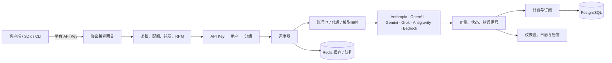

# Sub2API 项目功能说明书

> 文档基线：代码提交 `a1930ea6`；生成日期：2026-07-22。本文依据当前前后端实现、路由、数据模型与部署配置整理，适用于产品、运维、实施和二次开发人员。

## 1. 项目定位

Sub2API 是一个多上游账号、多租户的 AI API 网关。它把上游订阅账号、OAuth 凭据、API Key、AWS Bedrock 或 Google 服务账号组织为可调度的**账号池**；管理员将账号池配置到**分组**，再把分组授权给用户的 **Sub2API API Key**。用户仅需使用平台签发的 Key，即可通过兼容 Anthropic、OpenAI、Gemini 与 Codex 的入口访问模型。

平台同时负责认证、限流、账号选择、失败隔离、用量计量、余额/订阅扣费、支付履约、告警和审计。因此它既可用于面向用户的 API 服务，也可用作内部团队的统一 AI 接入层。

## 2. 总体架构与核心对象

| 对象 | 作用 | 关键关系 |
| --- | --- | --- |
| 用户 | 使用平台、持有余额、订阅和 API Key 的主体 | 一个用户可有多个 Key、订阅、身份绑定和用量记录 |
| API Key | 对外调用凭据，可指定一个分组 | 请求入口先定位到 Key、用户和分组 |
| 分组 | 面向用户的服务套餐/路由单元 | 限定平台、账号集合、倍率、模型路由、RPM、订阅配额及媒体权限 |
| 账号 | 真实上游凭据与运行状态 | 可配置 OAuth、Setup Token、API Key、上游透传、Bedrock、Service Account 等类型；可关联代理和多个分组 |
| 渠道 | 对外可售的逻辑服务与模型定价配置 | 可关联分组，并支持可用性展示和监控 |
| 订阅 | 用户获得某个订阅型分组的授权记录 | 管理有效期、日/周/月额度和使用进度 |
| 用量记录 | 每次成功或失败请求的审计及计费基础 | 汇总到用户、Key、分组、账号、模型及仪表盘 |
| 订单/支付提供商 | 自助购买套餐的交易单元 | 订单由支付回调确认，再履约为余额或订阅权益 |

## 3. 支持的平台与账号类型

### 3.1 上游平台

当前领域常量定义了 `anthropic`、`openai`、`gemini`、`antigravity`、`grok` 五种平台。网关按 API Key 所属分组的平台选择转发与协议转换策略。

| 平台 | 主要兼容入口与能力 |
| --- | --- |
| Anthropic | Messages、Token 计数、Models、Usage；可使用 Claude OAuth、Setup Token、API Key、Bedrock 等账号形式 |
| OpenAI / Codex | Responses、Chat Completions、Embeddings、Images、模型列表、WebSocket Responses；支持 Codex 客户端模型清单与专用 `/backend-api/codex` 别名 |
| Gemini | 原生 `v1beta` 模型与内容生成接口；支持 OAuth、API Key 与 Google Service Account/Vertex 相关能力 |
| Grok | OpenAI Responses/Chat Completions 兼容、Claude Messages 桥接、图片与视频生成；支持 xAI OAuth 或 API Key |
| Antigravity | 专用 Claude 与 Gemini 入口；可选择加入通用入口的混合调度，并可按 Claude/Gemini 文本/图像范围控制模型 |

### 3.2 账号类型

账号支持 `oauth`、`setup-token`、`apikey`、`upstream`、`bedrock`、`service_account`。账号可设置优先级、并发、负载因子、计费倍率、自动过期暂停、模型映射、请求头覆盖、代理与代理回退策略；OpenAI 账号还支持创建 Spark 影子账号以隔离部分额度维度。

## 4. 角色与权限边界

| 角色 | 可见范围 | 主要操作 |
| --- | --- | --- |
| 访客 | 登录、注册、找回密码、公开设置、支付结果页、初始化页 | 注册、OAuth 登录、验证邀请码/优惠码、密码重置 |
| 普通用户 | 自己的账户、Key、用量、订阅、订单和公告 | 创建/修改/删除自己的 API Key，查看可用分组和渠道，兑换卡密，购买套餐，配置 2FA 与通知邮箱 |
| 管理员 | 全部运营配置与数据 | 管理用户、分组、账号、渠道、代理、定价、支付、风控、备份、更新、告警与日志 |
| 外部支付提供商 | 仅支付 Webhook | 回调订单状态；无需用户 JWT，但会执行提供商签名/回调校验 |
| API 调用方 | 网关协议入口 | 使用 API Key 调用模型；不能访问管理 REST API |

`RUN_MODE=simple` 用于个人/内部简化场景：前端会隐藏部分 SaaS 页面，服务端跳过计费与余额校验。生产环境必须显式确认简易模式；标准模式才适合需要余额、订阅及支付的对外服务。

## 5. 用户侧功能

### 5.1 账户、认证与安全

1. 支持邮箱注册、登录、刷新令牌、退出、忘记/重置密码和邮箱验证码。
2. 支持 GitHub、Google、LinuxDo、微信、OIDC、钉钉等 OAuth 登录；新 OAuth 身份可完成邮箱验证、创建新账号或绑定现有账号。
3. 用户可查看与更新个人资料、修改密码、绑定/解绑邮箱或第三方身份。
4. 支持 TOTP 双因素认证：查询状态与验证方式、发送验证邮件、初始化二维码、启用和停用。
5. 支持通知邮箱验证、启停和删除；也提供退订链接入口。
6. 认证高风险接口使用 Redis 限流，并在 Redis 失效时按 fail-close 处理，避免注册、登录和验证码接口失去保护。

### 5.2 API Key 与服务访问

用户可创建、列出、查看、更新和删除自己的 API Key。Key 可绑定可用分组；分组决定请求可使用的上游平台、模型、倍率与限额。用户还可：

- 查询自己可用分组、分组倍率和可售/可用渠道；
- 查看每个 Key 的每日用量；
- 查看完整请求用量、错误请求、单条记录和汇总统计；
- 在个人仪表盘查看统计、趋势、模型分布、Key 消耗与聚合快照；
- 查询个人平台配额（日/周/月维度）。

### 5.3 权益、通知与商业功能

- 公告：查看可见公告并标记已读。
- 卡密：兑换额度/权益并查看兑换历史。
- 订阅：查看全部订阅、当前有效订阅、进度与权益摘要。
- 邀请返利：查看自己的邀请数据，并可按规则转移返利额度。
- 支付：查看支付配置、套餐、可用支付渠道和限额；创建、查询、验证、取消订单，提交退款申请，查询可退款提供商和本人订单。
- 批量图片：前端包含批量图片操作指引；网关提供任务提交、查询、取消、下载和清理输出能力，是否可用取决于分组和系统开关。

## 6. 管理端功能

### 6.1 看板与用户运营

管理员仪表盘提供总览快照、实时指标、用量趋势、模型/分组统计、API Key 趋势、用户趋势、用户消耗排名和批量使用量查询；支持对近期聚合数据回填。

用户管理涵盖用户 CRUD、余额调整与余额流水、用户 Key/用量查看、替换分组、并发批量设置、RPM 状态、用户平台日/周/月配额设置与重置。还可定义自定义用户属性（定义、排序、批量读取、给用户赋值），用于标记用户等级、业务来源等运营维度。

### 6.2 分组、渠道与计费策略

分组是管理端最重要的业务配置。管理员可创建、修改、删除、排序分组，并查看使用摘要、容量、账号统计和关联 Key。分组可配置：

- 平台、状态、描述、是否独占、关联账号及账号优先级；
- 基础倍率和高峰时段倍率；高峰区间为本地时区同日左闭右开区间；
- 订阅类型、默认有效期、日/周/月美元额度；
- 模型精确/通配符路由、默认映射模型与模型列表展示配置；
- 每分钟请求数（RPM）、按用户覆盖的 RPM/倍率；
- OAuth-only、隐私设置要求、Claude Code 专用、故障回退分组；
- 图片/批量图片/视频权限，以及图片分辨率与视频清晰度的独立计费；
- OpenAI 网页搜索单价、Antigravity MCP XML 注入及支持模型范围。

渠道管理用于维护渠道、默认模型定价和定价模型同步。渠道监控可创建检查任务、手动执行、查看状态与历史；检查模板可复用、编辑、关联监控并批量应用。用户侧也可只读查看可用渠道与监控状态。

### 6.3 上游账号、代理与接入配置

账号管理支持单个/批量创建、编辑、删除、批量更新凭据、导入导出、Claude Code/Codex 会话导入、外部 CRS 同步及预览。日常运维可对账号执行连通性测试、刷新令牌/套餐等级、恢复状态、清理错误/限流、重置额度、暂停/恢复调度、查看实时可用模型、上游模型同步、查看用量和当日统计。

各上游的授权辅助接口包括 Claude、OpenAI、Gemini、Antigravity 和 Grok 的授权 URL 生成、回调码兑换、刷新 Token/账号、额度查询或重置；账户可设置隐私状态。代理管理支持 CRUD、批量创建/删除、导入导出、连通性与质量检查、统计和关联账号查询。

### 6.4 支付、订阅与营销

支付系统内置 EasyPay、支付宝直连、微信支付、Stripe、Airwallex 等提供商模型，并支持多个提供商实例、可见支付方式路由和策略配置。管理员可：

- 查看支付看板，维护支付总配置；
- 管理订单，取消订单、重试履约、处理或查询退款；
- 管理套餐（CRUD）与支付提供商实例（CRUD）；
- 分配、批量分配、延期、重置、撤销、恢复用户订阅；
- 生成、批量更新、导出、作废卡密，并通过 `create-and-redeem` 接口完成创建即兑换；
- 管理优惠码及其使用记录；
- 查看邀请、返利和转移流水，并为指定用户配置返利比例。

### 6.5 风控、审计、运维与系统维护

- 内容风控：管理配置与上游密钥测试，查看运行状态和匹配日志，解除用户封禁，删除命中哈希或清空命中库。
- 运维中心：实时并发、用户并发、账号可用性、实时流量、QPS/TPS WebSocket；告警规则、事件、静默和邮件通知；日志运行参数与指标阈值；请求错误、上游错误、请求钻取、系统日志与清理；吞吐/延迟/错误趋势与 OpenAI Token 统计。
- 用量治理：管理员可检索全局用量、用户/Key，创建、查看和取消历史用量清理任务。
- 备份：配置并测试 S3、设置定时备份、创建/查询/删除备份、获取下载链接和执行恢复；另有数据管理代理的健康检查、数据源/S3 配置档和异步备份任务能力。
- 系统：查看版本、检查更新、查看可回滚版本、在线更新、回滚和重启服务。
- 合规：管理员首次进入需确认部署/运营合规状态；合规中间件会保护管理 API。

## 7. 网关请求生命周期与调度规则

### 7.1 通用流程

1. 客户端以平台 API Key 发起请求。
2. 网关写入客户端请求 ID、规范化入口路径、限制请求体，并记录运维错误上下文。
3. API Key 鉴权加载用户和所属分组；未分组 Key 会按 Anthropic 或 Google 协议格式返回错误。
4. 标准模式下检查账户状态、余额/订阅、用户平台额度、用户/分组 RPM 和并发槽位。
5. 调度器在目标分组选择平台兼容、模型可用、未过期、未暂停、未处于 429/529/临时故障冷却且未超配额的账号；可优先使用粘性会话、显式模型路由、账号优先级和负载因子。
6. 平台适配器将请求透传或转换到上游；流式响应保持流式转发。成功和失败都会更新账号状态、用量与运维数据。
7. 请求完成后写入用量记录，按用户/分组/账号倍率、媒体尺寸/清晰度或搜索次数计算费用，并更新仪表盘聚合。

### 7.2 可用性与故障隔离

账号只有同时满足 `active`、可调度、未自动过期暂停、未进入 529 过载窗口、未进入 429 限流窗口、未处于临时不可调度状态，并且 API Key/Bedrock 账号未超上游额度时，才会进入候选池。401、403、429、529 和传输错误可触发不同的刷新、冷却、临时下线或重试策略，避免将持续故障账号反复分配给用户。

调度缓存与快照存放在 Redis；配置变更通过 outbox/刷新机制使缓存重建，必要时可受控回源数据库。这样可降低高并发请求直接读取 PostgreSQL 的频率，同时保留缓存不一致时的降级路径。

## 8. 对外协议入口

除管理 API 外，网关路由均使用平台 API Key。`/v1` 既承载 Claude 风格接口，也能依据分组平台自动分派 OpenAI/Grok 兼容请求。

| 路径族 | 认证 | 说明 |
| --- | --- | --- |
| `POST /v1/messages` | API Key | Anthropic Messages；OpenAI/Grok 分组可走兼容桥接 |
| `POST /v1/messages/count_tokens` | API Key | Anthropic 计数；OpenAI 分组有兼容实现 |
| `GET /v1/models`、`GET /v1/usage` | API Key | 模型列表和用量；含 Codex 客户端清单识别 |
| `POST /v1/responses`、`/responses` | API Key | OpenAI Responses 及无前缀别名，支持子路径和 WebSocket GET 入口 |
| `POST /v1/chat/completions`、`/chat/completions` | API Key | OpenAI Chat Completions 兼容 |
| `POST /v1/embeddings`、`/embeddings` | API Key | 仅 OpenAI 分组 |
| `POST /v1/images/generations`、`/images/edits` | API Key | OpenAI 或 Grok 图片能力，受分组权限控制 |
| `POST /v1/videos/generations`、`GET /v1/videos/:request_id` | API Key | Grok 视频生成/查询，受分组权限控制 |
| `/v1/images/batches...` | API Key | 批量图片：提交、模型、任务/条目查询、下载、取消、删除记录/输出 |
| `/v1beta/models...` | API Key | Gemini SDK/CLI 原生兼容接口 |
| `/backend-api/codex/...` | API Key | Codex 客户端 Responses、模型和 WebSocket 专用别名 |
| `/antigravity/v1/...`、`/antigravity/v1beta/...` | API Key | 强制调度到 Antigravity 的 Claude/Gemini 专用入口 |
| `/antigravity/models` | API Key | Antigravity 模型列表 |
| `GET /health` | 无 | 健康检查，返回 `{"status":"ok"}` |

## 9. REST 管理 API 范围

应用管理 API 的基路径为 `/api/v1`。普通用户接口使用 JWT，管理员接口位于 `/api/v1/admin` 且需要管理员 JWT 与合规确认。以下是按资源归类的功能清单，不替代字段级 API 契约。

| API 域 | 代表资源/操作 |
| --- | --- |
| 认证与公开设置 | `/auth/*` 注册、登录、刷新、退出、密码恢复、OAuth；`/settings/public`；`/auth/me` |
| 用户自助 | `/user/*` 资料、密码、身份、2FA、通知邮箱、平台配额；`/keys`；`/usage`；`/subscriptions`；`/redeem`；`/announcements` |
| 支付 | `/payment/*` 套餐、订单、退款；`/payment/public/*` 恢复/查询；`/payment/webhook/*` 支付回调 |
| 用户/分组/账号 | `/admin/users`、`/admin/groups`、`/admin/accounts` 的 CRUD、统计、批量操作、权限与调度维护 |
| 平台 OAuth | `/admin/openai`、`/admin/gemini`、`/admin/antigravity`、`/admin/grok` 的授权、换码、刷新和配额操作 |
| 渠道与基础设施 | `/admin/channels`、`/admin/channel-monitors`、`/admin/proxies`、`/admin/tls-fingerprint-profiles`、`/admin/error-passthrough-rules` |
| 商业配置 | `/admin/payment`、`/admin/subscriptions`、`/admin/redeem-codes`、`/admin/promo-codes`、`/admin/affiliates` |
| 运维与数据 | `/admin/dashboard`、`/admin/ops`、`/admin/usage`、`/admin/backups`、`/admin/data-management`、`/admin/system` |
| 安全与合规 | `/admin/compliance`、`/admin/risk-control`、`/admin/settings/admin-api-key` |

支付对接的字段级说明可继续参考 [ADMIN_PAYMENT_INTEGRATION_API.md](ADMIN_PAYMENT_INTEGRATION_API.md)，支付配置与回调流程可参考 [PAYMENT.md](PAYMENT.md)。批量图片任务的完整生命周期和限制见 [BATCH_IMAGE_MVP.md](BATCH_IMAGE_MVP.md)。

## 10. 前端页面映射

前端为 Vue 3 单页应用，路由按访客、用户和管理员隔离，并依据公开设置、简易模式、后台模式、支付开关、风控开关及管理员身份进行前置守卫。

| 页面区域 | 主要页面 |
| --- | --- |
| 认证与初始化 | 登录、注册、邮箱验证、忘记/重置密码、各 OAuth 回调、初始化向导、法律文档 |
| 用户控制台 | 首页/仪表盘、API Key、用量、订阅、兑换、邀请、可用渠道、个人资料、订单、购买与支付结果 |
| 管理控制台 | 仪表盘、运维、用户、分组、账号、渠道/监控、订阅、代理、公告、卡密、优惠码、设置、风控、用量、邀请记录、支付看板/订单/套餐、备份 |

前端使用懒加载页面与路由预取；发生部署后动态 chunk 加载失败时，会控制频率地自动刷新一次页面。页面文案具备国际化资源。

## 11. 数据存储、后台任务与部署

### 11.1 存储职责

- **PostgreSQL**：用户、账号、Key、分组关系、订阅、订单、支付提供商、用量、风控、监控、备份配置等持久数据；`backend/migrations` 存放顺序迁移脚本。
- **Redis**：认证与接口限流、API Key/订阅/调度快照缓存、并发槽位、批量图片队列、短期状态和部分实时指标。
- **可选 S3/兼容对象存储**：备份以及批量图片/Vertex 相关输入输出。

### 11.2 后台工作

系统包含 Token 刷新、订阅过期与配额维护、用量异步写入/清理、仪表盘预聚合、账号/渠道定时测试、告警评估、日志清理、批量图片延迟任务移动与恢复、备份等后台任务。管理界面可以查看其中部分任务的结果或健康状态。

### 11.3 初始化与运行方式

首次运行可通过浏览器初始化向导或 `--setup` CLI 模式完成配置；Docker 部署使用 `AUTO_SETUP=true` 从环境变量初始化管理员、数据库连接及基础配置。服务启动后会嵌入并提供已构建的前端静态资源。

最关键的生产配置项包括：

- `POSTGRES_PASSWORD`、数据库连接池与 Redis 密码；
- 固定的 `JWT_SECRET`（否则重启会导致会话失效）；
- 固定的 `TOTP_ENCRYPTION_KEY`（否则既有 2FA 密钥不可解密）；
- `TZ`（影响用量“当天”、订阅到期及日志时间边界）；
- `RUN_MODE`、`OPS_ENABLED`、网关请求体限制、上游连接池、图片并发和 URL 白名单；
- Gemini/Antigravity/Grok 等 OAuth 客户端配置，以及可选更新代理。

标准 Docker Compose 会启动 `sub2api`、PostgreSQL 和 Redis，并使用 `/health` 进行健康检查。部署方式、环境变量和迁移注意事项见 [deploy/README.md](../deploy/README.md) 与 [deploy/DOCKER.md](../deploy/DOCKER.md)。

## 12. 安全与实施建议

1. 将网关 API Key、OAuth Token、支付密钥、数据库密码和备份对象存储凭据视为敏感信息；不要提交到仓库或在日志中输出。
2. 生产环境务必固定 JWT 与 TOTP 加密密钥，启用 HTTPS，并限制管理端访问来源。
3. 若使用 Nginx 代理 Codex CLI，请在 `http` 块设置 `underscores_in_headers on;`，以确保相关请求头能被正确转发。
4. 上游 URL 白名单在可信网络以外应启用，并关闭对私网地址和明文 HTTP 的不必要放行，降低 SSRF 与误配风险。
5. 为账号设置合理并发、优先级、倍率、代理和冷却策略；先在渠道监控中验证后再向用户开放分组。
6. 正式运营前配置支付 Webhook、邮件通知、S3 备份、运维告警和用量清理策略，并定期演练恢复。
7. 项目涉及将订阅服务能力作为 API 网关转发。部署和使用前应自行确认上游服务条款、当地法律及组织合规要求。

## 13. 源码导航

| 位置 | 说明 |
| --- | --- |
| `backend/cmd/server/main.go` | 启动入口、首次初始化与优雅退出 |
| `backend/internal/server/router.go` | 全局中间件、嵌入式前端与路由注册 |
| `backend/internal/server/routes/` | 认证、用户、管理、支付和网关路由清单 |
| `backend/internal/service/` | 调度、协议适配、计费、支付、账号、运维等领域逻辑 |
| `backend/ent/schema/` | 核心持久化实体定义 |
| `backend/migrations/` | PostgreSQL 演进迁移 |
| `frontend/src/router/index.ts` | 前端页面、权限守卫和功能开关保护 |
| `frontend/src/views/` | 用户、管理端和认证页面实现 |
| `deploy/` | Docker、Compose、环境变量与部署说明 |

---

## 14. 推荐的实施顺序

1. 部署 PostgreSQL、Redis 与 Sub2API，完成初始化并固定密钥。
2. 配置站点、邮件、OAuth 和安全策略；创建管理员后启用合规确认。
3. 创建代理（如需）、上游账号并完成凭据测试、Token 刷新和模型同步。
4. 创建分组，绑定账号，设置模型路由、额度、倍率、RPM 与媒体权限。
5. 创建渠道和监控，确认运行状态后给测试用户授权分组并签发 API Key。
6. 使用目标客户端分别验证 Claude、OpenAI/Codex、Gemini 等入口，核对流式响应、用量、扣费和错误日志。
7. 配置套餐、支付提供商及 Webhook；再开放卡密、订阅和自助购买。
8. 最后配置告警、备份、日志保留、用量清理与升级/回滚预案。

